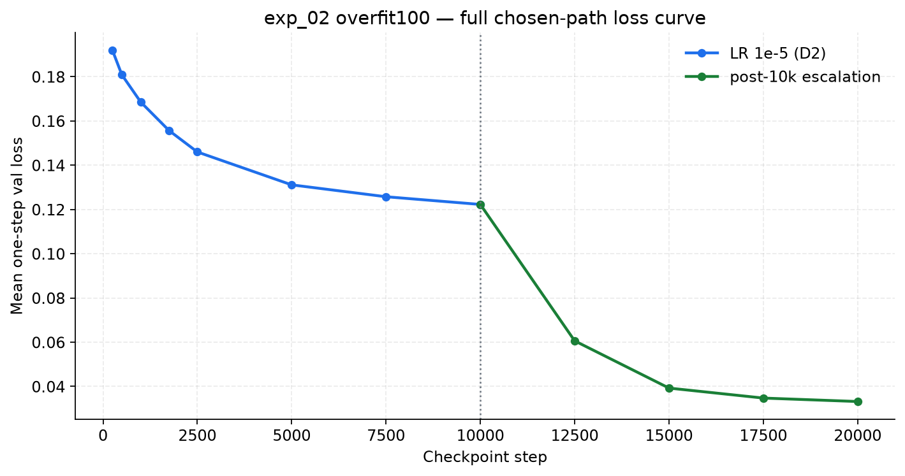
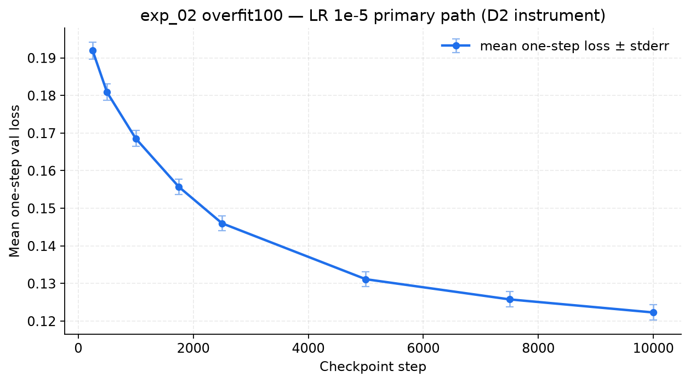
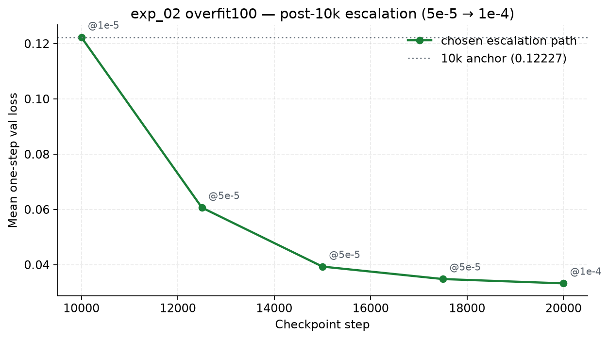
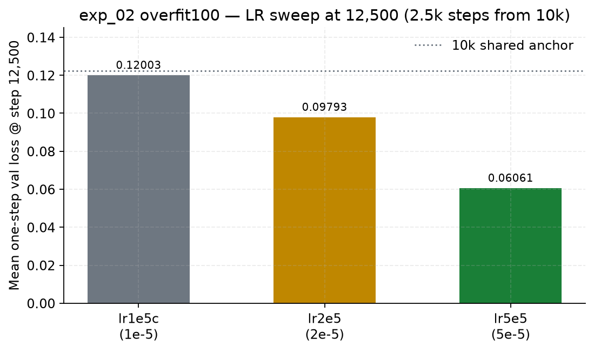

# exp_02 overfit100 — one-step validation loss curve

Physical figures for the authoritative one-step val-loss trajectory (not W&B train
logs). Protocol: fixed `(t, ε)` keyed by `(episode_id, window_start)`, mean over
all **1,629** `train100` windows, validation seed 0.

| Field | Value |
| --- | --- |
| Run | `wan-overfit100-s3-20260730` |
| Dataset | `gs://v6_east1d/datasets/exp02_overfit100/train100` |
| Checkpoint root | `gs://v6_east1d/checkpoints/maxdiffusion/wan-ti2v-overfit100/wan-overfit100-s3-20260730/` |
| Primary source (≤10k) | [`diagnostics/d2_val_loss_by_checkpoint.json`](diagnostics/d2_val_loss_by_checkpoint.json) |
| Extension source (>10k) | instrument readings in [`overfit100_results.md`](overfit100_results.md) |
| Figures | [`diagnostics/figures/`](diagnostics/figures/) |

---

## Summary

| Milestone | Step | LR | Mean one-step loss |
| --- | ---: | --- | ---: |
| First D2 point | 250 | 1e-5 | 0.19191 |
| End of 1e-5 primary path | 10,000 | 1e-5 | 0.12227 |
| After chosen LR raise | 12,500 | 5e-5 | 0.06061 |
| Final measured point | 20,000 | 1e-4 (from 17.5k) | 0.03320 |

Total drop 250 → 20k: **0.1587**.

---

## Figure 1 — Full chosen-path curve

Blue: LR **1e-5** D2 instrument through 10k. Green: post-10k escalation
(5e-5 through 17.5k, then 1e-4 probe to 20k). Vertical dotted line = LR switch
at step 10k.

---

## Figure 2 — Primary path (LR 1e-5, D2)

Error bars are per-checkpoint stderr (≈0.002 everywhere; barely visible).

| step | mean_loss | stderr | n |
| ---: | ---: | ---: | ---: |
| 250 | 0.19191296 | 0.00227222 | 1629 |
| 500 | 0.18083675 | 0.00218618 | 1629 |
| 1000 | 0.16852597 | 0.00211173 | 1629 |
| 1750 | 0.15566056 | 0.00203783 | 1629 |
| 2500 | 0.14598195 | 0.00201166 | 1629 |
| 5000 | 0.13111325 | 0.00202347 | 1629 |
| 7500 | 0.12574633 | 0.00203423 | 1629 |
| 10000 | 0.12226718 | 0.00204478 | 1629 |

Train commit (D2 rows): `81ae5717cf631e654c6f2af918360a6e98787c3c`.
Eval commit (D2 rows): `577692255194dc9ec791d4003b2544b3581d06cd`.

---

## Figure 3 — Post-10k escalation

Shared 10k anchor **0.12227** (bit-exact across arms). Chosen path: raise to
**5e-5**, then a **1e-4** probe from 17.5k → 20k.

| step | LR on this segment | mean_loss | notes |
| ---: | --- | ---: | --- |
| 10000 | 1e-5 | 0.12227 | D2 / shared anchor |
| 12500 | 5e-5 | 0.06061 | chosen arm of LR sweep |
| 15000 | 5e-5 | 0.03927 | |
| 17500 | 5e-5 | 0.03476 | pace collapsing |
| 20000 | 1e-4 | 0.03320 | 1e-4 probe; no pace restore |

---

## Figure 4 — LR sweep at step 12,500

All arms restore the bit-exact 0.12227 @10k, then train 2,500 steps at the arm LR.

| arm | LR | loss @10000 | loss @12500 | Δ / 2,500 steps |
| --- | --- | ---: | ---: | ---: |
| lr1e5c (control) | 1e-5 | 0.12227 | 0.12003 | −0.00224 |
| lr2e5 | 2e-5 | 0.12227 | 0.09793 | −0.02434 |
| **lr5e5 (chosen)** | **5e-5** | **0.12227** | **0.06061** | **−0.06166** |

---

## Notes

- This is **not** the noisy per-step training loss from process-0 stdout / W&B.
  exp_02 training launches did not wire `WANDB_PROJECT`, so there is no
  `maxdiffusion-wan-overfit100` W&B project for this run.
- Authoritative analysis curves should prefer this document + the D2 JSON over
  any host train-log scrape.
- Interactive sibling (IDE-only): canvas
  `exp02-overfit100-loss-curve.canvas.tsx` under the Cursor project canvases
  directory.
